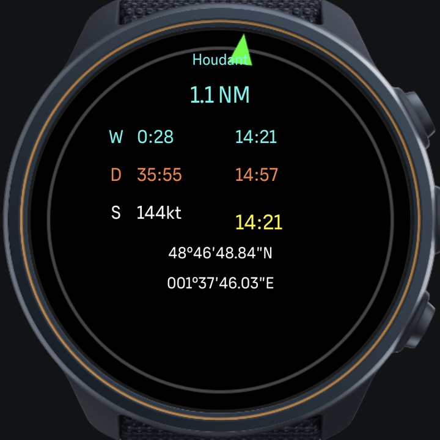
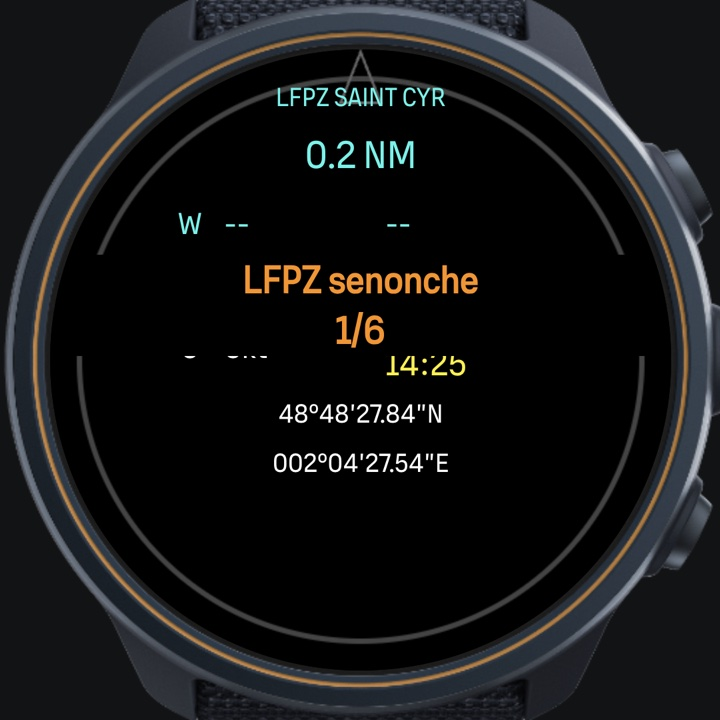
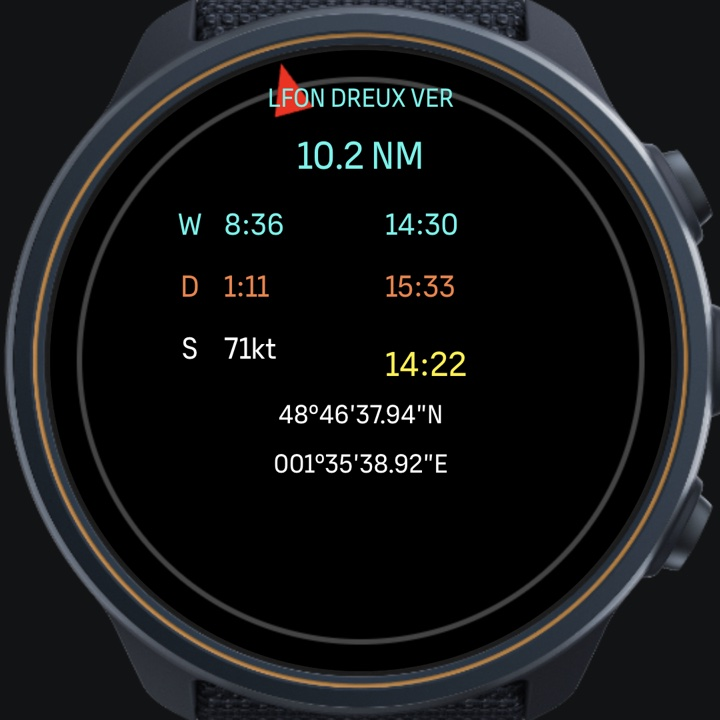
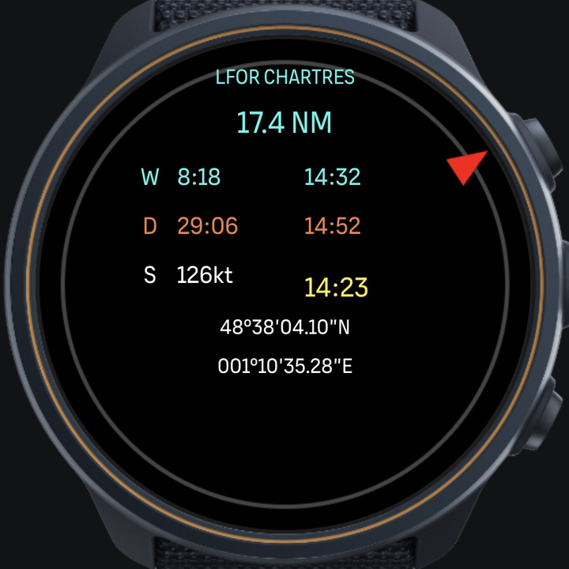

# Navigator

A navigator's instrument on a Suunto watch with GPS and SuuntoPlus:
bearing, distance and time to every waypoint of a route, wherever you
are. Developed and tested on a Suunto Ocean, first for flying under
visual flight rules, where the next waypoint and the time to it are
the whole job, and used on foot as well.

The presentation page is at <https://renard.github.io/navigator/>,
served by GitHub Pages from `docs/`.

<p align="center">
  
</p>

<p align="center">
  
  
  
</p>

- On course: the marker is at the top and green, Houdant 1.1 NM ahead
  and 28 seconds away.
- Choosing a route: hold the down button and the route you follow
  shows, here the first of six, then click for the next, nearest
  first.
- Off course: the marker shows where the waypoint is, red beyond ten
  degrees. Turn until it is back at the top.
- Well away from the line, the waypoint still has its bearing, its
  distance and its times.

Screens from the SuuntoPlus simulator.

## What it is

Two halves that only make sense together:

- `watch/` is the SuuntoPlus feature: the screen on the wrist, a ring
  whose marker points at the next waypoint, the times to run and the
  times of arrival, the position.
- `packer/` turns the GPX routes a flight planner produces into the
  one compact string the feature carries. It is a command line tool,
  and the same code compiled to WebAssembly for the page in `docs/`.

Each half has its own README with the detail. This file is only the
shape of the thing.

## Motivation

The watch's route navigation is designed around following the line:
while you are on the route it names the next waypoint and counts the
distance down to it, to about a meter. More than about a hundred
meters from the line it considers you off route and waits for you to
rejoin it, which is what a runner or a hiker wants.

A VFR pilot is off the line most of the time, by design or by wind,
and still needs the bearing and the time to the next turn point. A
SuuntoPlus feature can read the watch's distance to the next waypoint
but not the waypoint's coordinates, so Navigator brings its own:

- While on route, each distance the watch reports says the waypoint
  lies on a circle around a known position, and circles taken from a
  moving aircraft meet at one point. Solving that gives the
  waypoint's position, from which the bearing follows.
- Solving only covers the leg being flown. So the feature also carries
  the whole route, which is what the packer is for. With the route in
  hand every waypoint is known from the first second, on the line or
  off it.

## Getting a route onto the watch

Open the converter page, `docs/convert.html`, drop the GPX files on
it, and keep the `data.json` it offers to build the feature with.
Once the feature is published, the string it shows can be pasted into
the feature's route setting from the phone instead.

The page is a static file. It can be published as it stands, since
GitHub Pages serves a repository's `docs/` directory, or served from
here to try it, including from a phone on the same network:

```
$ cd docs && python3 -m http.server 8000
```

Then open `http://<this machine>:8000/convert.html` on the phone. It
cannot be opened as a plain file: a page loaded from `file://` is not
allowed to fetch its own WebAssembly, so it needs a server of some
kind, however humble.

Two things behave differently over plain http than they will on the
published site. The copy button needs a secure context and will do
nothing; the text is selected instead, ready for a long press. And
macOS may ask whether python should accept incoming connections, which
it has to for the phone to reach it.

The conversion runs in the visitor's own tab, so the route never
leaves their machine, and there is no service to keep running or to
keep safe.

The same conversion runs without a browser:

```
$ ./routepack pack --data ../watch/data.json ../examples/*.gpx
Cannes-Nice.gpx           5 waypoints  32164 m   125 bytes
Chateaux-Loire.gpx       20 waypoints 521493 m   589 bytes
Paris.gpx                 6 waypoints   2444 m   142 bytes

3 routes, 858 bytes of 2048
written to ../watch/data.json, padded to 2048
```

Then the feature itself is built and sent to the watch from `watch/`
with the SuuntoPlus Editor extension for VS Code, whose `SuuntoPlus:
Build` and `SuuntoPlus: Deploy to Watch` commands do the two jobs.
"Navigator" is then added as a data screen to a GPS sport mode. The
watch has to be paired with the machine, and the phone must not be
holding the Bluetooth link.

## What has to be on the machine

Nothing in this repository is installed; it all runs from where it
sits. What it expects to find:

- **Go 1.23 or later**, to build the converter. The Makefile takes
  whatever `go` is on the PATH, and `GO=` overrides it.
- **VS Code with the SuuntoPlus Editor extension**, to build the
  feature and send it to the watch. The builder and the device
  server it drives belong to Suunto and ship inside the extension.

## Layout

- `watch/` the feature: `main.js`, `nav.html`, `manifest.json` and
  the data file.
- `packer/` the converter: a Go module holding the packing rules, a
  command line tool, and the same code built to WebAssembly for the
  page.
- `examples/` a few real VFR routes as GPX, which is what the
  packaged `data.json` is built from, so a fresh clone flies
  something without anybody having to plan a trip first.
- `docs/` what GitHub Pages serves: the presentation page,
  `index.html`, and the converter, `convert.html`.
  Its `navigator.wasm` is built by `make site` from `packer/`.
- `notes/` the correspondence with Suunto's forum about the missing
  resources, question and reply.

## Licence

AGPL, both halves.
